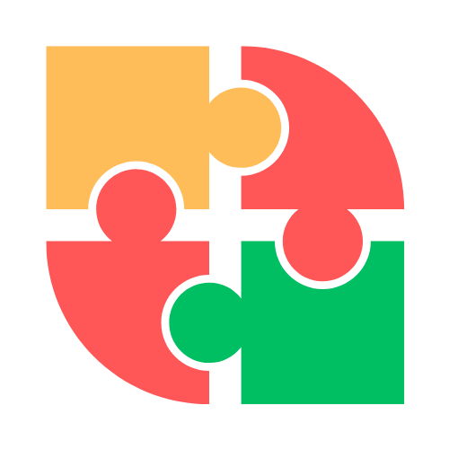

# 🤝 MAKEDEAL -  Blue Bit Hackthon Project

<p align="center">
  
</p>

<br>


## Where Ideas Meet Opportunity 🚀

 A Social Media Platform For Aspiring Entrepreneurs And Startups

<br>


## 💡 The Idea

 Developing a social media platform for aspiring entrepreneurs
 and startups presents an exciting opportunity to foste innovation and collaboration within the entrepreneurial community.


## ⭐ Features
- Dedicated User registration and profiles
- Startup Profiles
- Mentorship Programs
- Follow Functionality:
<!-- - Fundraising ( Using Blockchain )
- Dedicated voting mechanism to rate the product -->

## 🌠 Technologies used

- Figma
- ReactJS [Frontend Framework] 
- Node.JS 
- MongoDB
- Express.JS
<!-- - 
- -->
- External Javascript Libraries

## Deployed link


## Installation
``` 
git clone https://github.com/marotipatre/CrackCase_2.1.1
```
```                   
cd backend
```
``` 
npm install
```
``` 
npm run dev
```
``` 
cd frontend
```
``` 
npm install
```
``` 
npm run dev
```

#### Ready to go 🚀

## Team CrackCase 👨‍💻
- Akash Nipunge
- Aniket Labade
- Maroti Patre


## Presentation Link


## Demo Link


 


